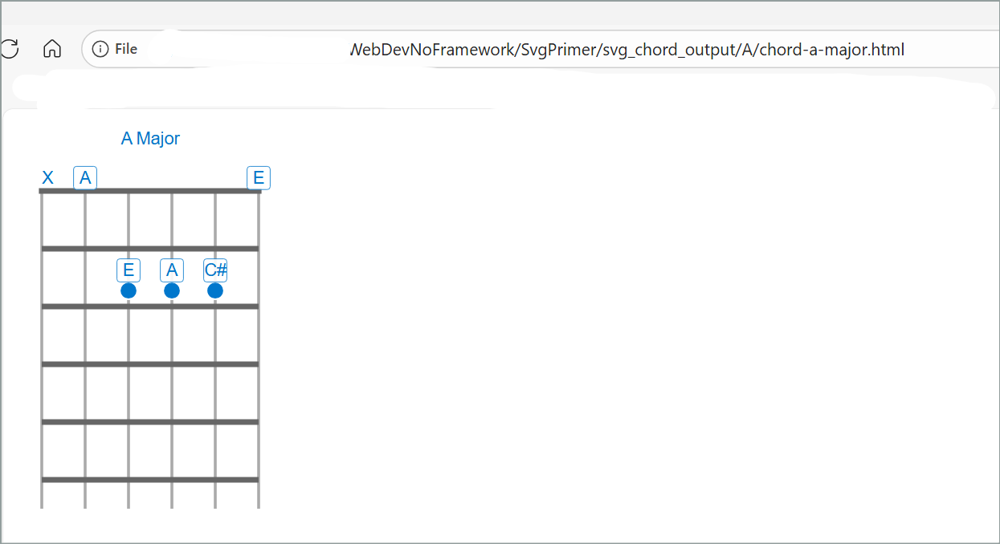

# SVG Guitar Chord Diagram Generator

This script ([Svg/Chords/code/generate_chord_as_svg.py](Svg/Chords/code/generate_chord_as_svg.py)) generates SVG-based HTML chord diagrams for guitar from a text file containing chord definitions.

## Features

- Reads chord definitions from a text file (`code/chords.txt`)  
- Supports chord code, chord name, and optional comments  
- Outputs styled SVG diagrams to the `svg_chord_output/` directory  
  - within that directory, each chord is placed in its own subdirectory named after the chord
- Automatically labels notes, muted strings, and open strings  

## Usage

1. **Prepare your chord definitions**    
   Format each line in `code/chords.txt` as:  
   ```
   chord_code | chord_name | comment (optional)
   ```
   Example:
   ```
   X02220 | A Major | stuff 1
   ```
   The convention followed uses `X` for muted or unplayed strings and `0` for open strings.  
   In this same convention, which is pretty standard, the first character ('X' in this case) always corresponds to String 6 or 'Low E', and the last character is String 1 or 'High E'.  
  

2. **Run the script**
   ```sh
   python code/generate_chord_as_svg.py
   ```

3. **View the output**  
   Generated HTML files will appear in the `svg_chord_output/` directory, in their own subdirectories named after the chord.

## Output Example

Each HTML file contains an SVG diagram styled with [css/fretboard.css](css/fretboard.css).  
Example output:  
  

## Customization

- Edit [css/fretboard.css](css/fretboard.css) to change diagram styles.  
- Modify `code/chords.txt` to add or update chords.  

## License

MIT License (see repository for details).  