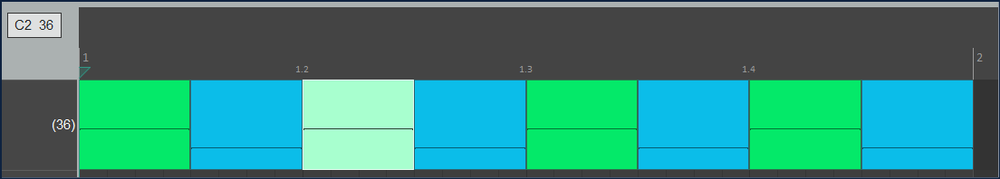

# MIDI Drum Pattern Tools

This repository contains multiple tools for creating MIDI drum patterns:

1. [Create MIDI Drum Track](#create-midi-drum-track)
2. [Velocity-Controlled Pattern Generator](#velocity-controlled-pattern-generator)

# How to express drum patterns?

After some playing around with input text data formats for drum patterns, right now this works best for me:  
For a given Score (let's use a term that occurs in Music21, which I prefer over the Mido library, right now), give each drum its own pattern.  
Say I have a song (lowercase will mean `song` in a generic sense) which has 4 bars (sure, you would not get a song that is that short), each with 8 * 1/8 notes. Drums are:  
- kick (midi note 36)  - 1.1, 1.5, 2.1, 2.5, 3.1, 3.5, 4.1, 4.5
- snare (38) - 1.3, 1.7, 2.3, 2.7, 3.3, 3.7, 4.3, 4.7  
- hihat (42) - every 1/8th note 

The content of the source .csv for the kick pattern starts thus:   
``` python
Note,Velocity  
36,56  
36,30
...  
```

Hang on - where are the intervals? For songs where time signature and bpm remain constant throughout a song, I prefer to use a global config file to store all that. For example, in json format:
``` json
{
    "TimeSignature": "4/4",
    "bpm": 120,
    "quarterLength": 0.5
}
```
The music21 library seems to centre around the quarterLength variable, for controlling intervals. So if my notes are all ⅛ values, and the default is ¼, then I need quarterLength to have a value of 0.5.  
This is how you might grab those values: 
``` python
from json import load

with open('music21/demo_for_md/read_config_01.json','r') as f:
    configData = load(f)

bpm = configData.get("bpm")
quarterLength = configData.get("quarterLength")
ts = configData.get("TimeSignature")
```

And then stick the values into music21 objects: 
``` python
from json import load
from music21 import meter, tempo

with open('music21/demo_for_md/read_config_01.json','r') as f:
    configData = load(f)

bpm_config = configData.get("bpm")
quarterLength_config = configData.get("quarterLength")
ts_config = configData.get("TimeSignature")

ts = meter.TimeSignature(ts_config)
mm = tempo.MetronomeMark(number=bpm_config)
print(f"Time Signature: {ts_config}, BPM: {bpm_config}, quarterLength: {quarterLength_config}")
```

Get the data from the kick csv...
``` python
midi_data = read_csv('music21/demo_for_md/demo_kick.csv')
for i, row in midi_data.iterrows():
    print(f"Note: {row['Note']}, Velocity: {row['Velocity']}")  
```

Now add in a stream - I use insert, not append, as former is absolute, latter messes up if anything earlier is wrong  
At this point set the time signature (e.g. 4/4, and the bpm e.g. 120)
``` python
from music21 import meter, tempo, stream, note
#...
drum_stream = stream.Stream()
...
ts = meter.TimeSignature(ts_config)
mm = tempo.MetronomeMark(number=bpm_config)
drum_stream.insert(0.0, ts)
drum_stream.insert(0.0, mm)

```

Showing the whole code...
``` python
from json import load
from music21 import meter, tempo, stream, note
from pandas import read_csv

def insert_note(stream_obj, midi_note, velocity, quarterLength, offset):
    origin = 0.0
    n = note.Note()
    n.pitch.midi = midi_note
    n.quarterLength = quarterLength
    n.volume.velocity = velocity
    stream_obj.insert(origin + (offset), n)

drum_stream = stream.Stream()

with open('music21/demo_for_md/read_config_01.json','r') as f:
    configData = load(f)

bpm_config = configData.get("bpm")
quarterLength_config = configData.get("quarterLength")
ts_config = configData.get("TimeSignature")

ts = meter.TimeSignature(ts_config)
mm = tempo.MetronomeMark(number=bpm_config)
drum_stream.insert(0.0, ts)
drum_stream.insert(0.0, mm)

midi_data = read_csv('music21/demo_for_md/demo_kick.csv')
for i, row in midi_data.iterrows():
    print(f"Note: {row['Note']}, Velocity: {row['Velocity']}")  
    insert_note(drum_stream, row['Note'], row['Velocity'], quarterLength_config, i * quarterLength_config)

drum_stream.write('midi', fp="c:/temp/demo_01.mid")
           
```



# Velocity-Controlled Pattern Generator

A Python toolkit for creating MIDI drum patterns with precise velocity control using `music21`. This tool provides utilities for creating dynamic drum patterns with control over timing, velocity, and pattern sequencing.

## Features

- Create drum patterns using MIDI note numbers
- Control note velocity (dynamics) for each drum hit
- Flexible pattern sequencing with notes, chords, and rests
- Support for pattern repetition
- MIDI channel 10 (GM drum kit) compatibility

## API Reference

### `create_note_with_velocity(midi_note, velocity=64)`
Creates a single note with specified velocity.
- `midi_note`: MIDI note number (e.g., 36 for bass drum)
- `velocity`: MIDI velocity (0-127, default=64)

### `create_chord_with_velocity(midi_notes, velocity=64)`
Creates a chord (multiple simultaneous notes) with specified velocity.
- `midi_notes`: List of MIDI note numbers
- `velocity`: MIDI velocity (0-127, default=64)

### `append_sequence(stream_obj, sequence)`
Appends a sequence of musical elements to a stream.
- `stream_obj`: music21 Stream to append to
- `sequence`: List of notes, chords, or rests

## Example Usage

```python
from music21 import *
import copy

# Create notes/chords with velocity control
kick = create_note_with_velocity(36, velocity=80)  # Bass drum - strong
snare = create_chord_with_velocity([38], velocity=64)  # Snare - medium
hihat = create_note_with_velocity(42, velocity=50)  # Hi-hat - soft
rest = note.Rest()

# Define and play pattern
pattern = [kick, hihat, snare, hihat]
stream1 = stream.Stream()
append_sequence(stream1, pattern)
stream1.write('midi', fp="output.mid")
```

## Common MIDI Drum Numbers

General MIDI (GM) standard drum map for key percussion elements:

### Basic Kit
- 36: Bass Drum 1 (BD1)
- 35: Bass Drum 2 (BD2)
- 38: Acoustic Snare (ASN)
- 40: Electric Snare (ESN)
- 42: Closed Hi-Hat (CHH)
- 46: Open Hi-Hat (OHH)
- 51: Ride Cymbal 1 (RD1)
- 49: Crash Cymbal 1 (CR1)

### Toms
- 41: Low Floor Tom (LFT)
- 43: High Floor Tom (HFT)
- 45: Low Tom (LTM)
- 47: Low-Mid Tom (LMT)
- 48: Hi-Mid Tom (HMT)
- 50: High Tom (HTM)

### Latin/Percussion
- 44: Pedal Hi-Hat (PHH)
- 54: Tambourine (TMB)
- 56: Cowbell (CWB)
- 60: High Bongo (HBG)
- 61: Low Bongo (LBG)
- 62: Mute High Conga (MHC)
- 63: Open High Conga (OHC)
- 64: Low Conga (LCG)

## Example Patterns

### Basic Rock Beat
```python
kick = create_note_with_velocity(36, velocity=80)
snare = create_note_with_velocity(38, velocity=70)
hihat = create_note_with_velocity(42, velocity=50)
pattern = [kick, hihat, snare, hihat] * 2  # Repeat basic pattern
```

### Latin Groove
```python
conga_h = create_note_with_velocity(63, velocity=60)
conga_l = create_note_with_velocity(64, velocity=70)
cowbell = create_note_with_velocity(56, velocity=50)
pattern = [conga_h, cowbell, conga_l, cowbell, conga_h, conga_h, conga_l, cowbell]
```

### Jazz Pattern with Ghost Notes
```python
kick = create_note_with_velocity(36, velocity=75)
snare_ghost = create_note_with_velocity(38, velocity=30)  # Very soft "ghost" note
snare_accent = create_note_with_velocity(38, velocity=80)
ride = create_note_with_velocity(51, velocity=60)
pattern = [kick, ride, snare_ghost, ride, snare_accent, ride, snare_ghost, ride]
```

### Tom Fill
```python
tom_h = create_note_with_velocity(50, velocity=70)
tom_m = create_note_with_velocity(47, velocity=75)
tom_l = create_note_with_velocity(41, velocity=80)
crash = create_note_with_velocity(49, velocity=90)
pattern = [tom_h, tom_h, tom_m, tom_m, tom_l, tom_l, crash]
```

## Expanded Velocity Guidelines

### Standard Velocities
- 30-40: Ghost notes, very subtle hits
- 40-50: Soft background elements (e.g., hi-hat patterns)
- 50-60: Regular background elements
- 60-70: Normal hits, typical snare backbeats
- 70-80: Slightly accented notes
- 80-90: Strong accents, main beats
- 90-100: Power accents
- 100-127: Maximum impact (use sparingly)

### Usage Tips
1. **Dynamic Range**: Use a mix of velocities to create more realistic and dynamic patterns
2. **Ghost Notes**: Use very low velocities (30-40) for ghost notes on snare
3. **Hi-Hat Pattern**: Typically use lower velocities (40-60) for sustained hi-hat patterns
4. **Kick and Snare**: Main beats typically use 70-90 velocity range
5. **Accents**: Use higher velocities (90+) sparingly for climactic moments

## Troubleshooting Tips

### Common Issues and Solutions

1. **No Sound Output**
   - Verify MIDI channel is set to 9 (10 in 1-based counting)
   - Check if your playback device supports GM drum map
   - Ensure MIDI note numbers are within GM drum range (35-81)

2. **Wrong Drum Sounds**
   - Confirm you're using correct MIDI note numbers from GM drum map
   - Verify your synth/DAW is set to GM drum mode
   - Check if the instrument is properly configured for drum sounds

3. **Pattern Timing Issues**
   - Verify all notes have correct duration settings
   - Check for overlapping notes in the pattern
   - Ensure rests are properly placed and sized

4. **Velocity Not Working**
   - Confirm your playback device supports velocity
   - Check if velocities are within valid range (1-127)
   - Verify your DAW's velocity scaling settings

### Best Practices

1. **Pattern Creation**
   - Start with basic patterns and gradually add complexity
   - Use consistent velocity ranges for similar elements
   - Include appropriate rests for groove

2. **Performance**
   - Keep patterns in 4/4 time unless specifically needed
   - Use velocity to create natural-sounding dynamics
   - Consider using pattern variations for interest

3. **File Management**
   - Use clear naming conventions for patterns
   - Save different versions of complex patterns
   - Document any special velocity mappings used

---

# Create MIDI Drum Track
## Create MIDI Drum Track

This Python script generates a MIDI drum track for the song "Can't Help Falling in Love" and saves it as a `.mid` file. The generated MIDI file includes a simple drum pattern with kick, snare, and ride cymbal.

## Features

- Generates a MIDI drum track with a tempo of 68 BPM.
- Includes humanized timing for a more natural feel.
- Uses kick, snare (side-stick), and ride cymbal sounds.
- Saves the generated MIDI file to `drums/midi_drum_tracks/cant_help_drums.mid`.

## Requirements

The script requires the following Python packages:

- `mido==1.3.3`
- `packaging==25.0`
- `python-rtmidi==1.5.8`

Install the dependencies using `pip`:

```bash
pip install -r requirements.txt
```

## Usage

Run the script directly to generate the MIDI file:

```bash
python drums/create_midi_drum_track.py
```

The generated file will be saved at `drums/midi_drum_tracks/cant_help_drums.mid`.

## How It Works

1. **Tempo and Timing**: The script sets the tempo to 68 BPM and calculates timing for eighth notes and bars.
2. **Drum Pattern**: 
   - Kick drum plays on the first and seventh eighth notes of each bar.
   - Snare drum plays alongside the kick on the seventh eighth note.
   - Ride cymbal plays on every eighth note.
3. **Humanization**: Adds slight random variations to the timing for a more natural feel.
4. **MIDI File Creation**: The events are sorted, converted to delta times, and written to a MIDI file.

## File Structure

- `create_midi_drum_track.py`: The script to generate the MIDI file.
- `drums/midi_drum_tracks/cant_help_drums.mid`: The output MIDI file.
- `requirements.txt`: Lists the required Python packages.

## Example Output

Whilst the generated MIDI file can be opened in any MIDI editor, it would be more typically dragged into a DAW (in
my case Ableton Live), for further tweaking.

## License


This script is provided as-is under the MIT License.

